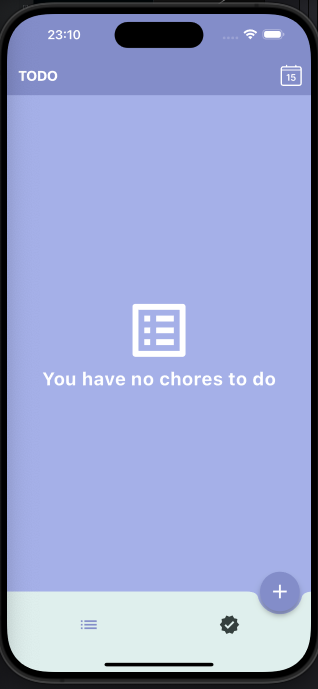
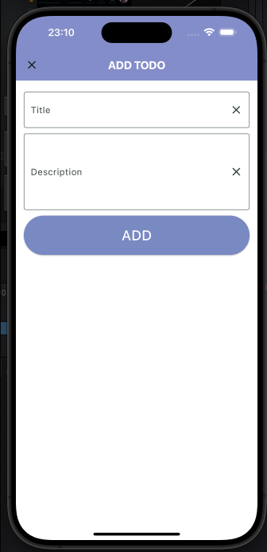
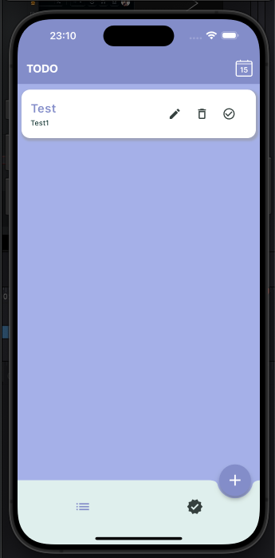

# Todo List App

Este é um aplicativo Todo List desenvolvido em Flutter para praticar estrutura de arquivos e gerenciamento de estado com BLoC.

## Demonstração da Interface de Usuário

A interface do usuário foi inspirada em [https://encurtador.com.br/DIPWX](#).

### Tela Inicial (Home)

### Adicionar Todo

### Todos Completados

## Tecnologias Utilizadas

- Flutter
- BLoC (Business Logic Component)

Este projeto está em constante evolução. Futuras atualizações incluirão:

- **Integração com Firebase Firestore:** Para armazenar e sincronizar dados do aplicativo na nuvem.
- **Integração com Firebase Authentication:** Para autenticar usuários e fornecer recursos personalizados.
- **Funcionalidade de Pomodoro:** Adição de recursos de gerenciamento de tempo usando a técnica Pomodoro.
- **Melhorias na Interface do Usuário:** Aprimoramento da experiência do usuário com novas funcionalidades e design.

Fique atento para futuras atualizações!

## Como Executar

1. Certifique-se de ter o Flutter instalado em seu sistema.
2. Clone este repositório: `git clone https://github.com/seu-usuario/todo-list-app.git`
3. Navegue até o diretório do projeto: `cd todo-list-app`
4. Execute o aplicativo: `flutter run`

## Estrutura de Arquivos

Tentei seguir o máximo das estruturas recomendadas pela comunidade Flutter, porém, como estou aprendendo ainda, a estrutura pode não ser perfeita. Aqui está uma visão geral!

